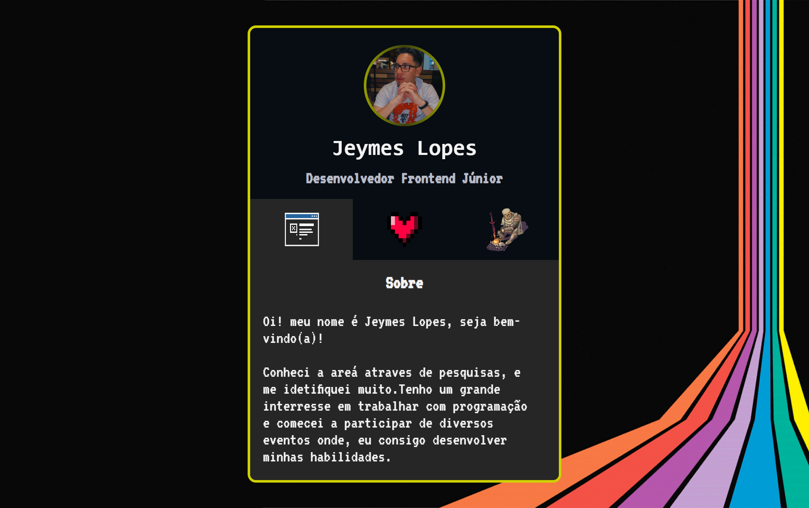

# Descrições do Projeto
 

## 👨‍💻 O projeto teve como base criar um mini portifólio, onde foram utilizados as seguintes linguagens.

- HTML
- CSS
- JavaScrip
- Git e GitHub
## 🗨️​ Contatos

jeymes.lopes.jl@gmail.com